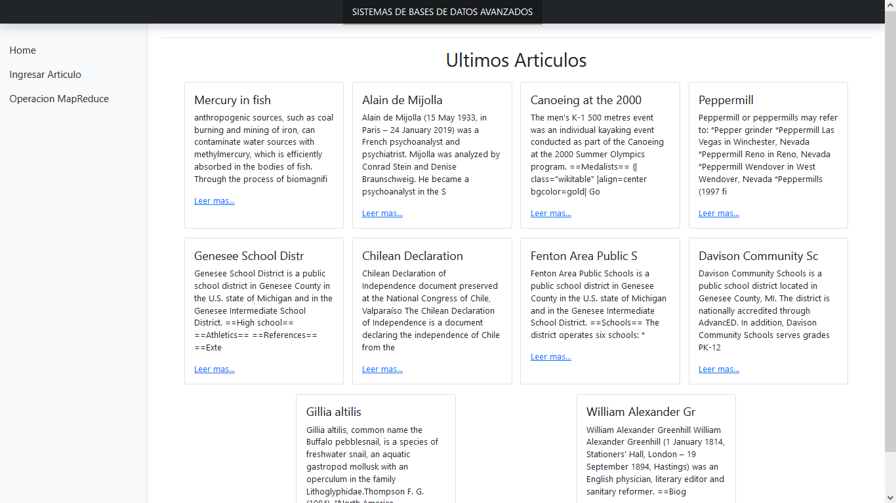
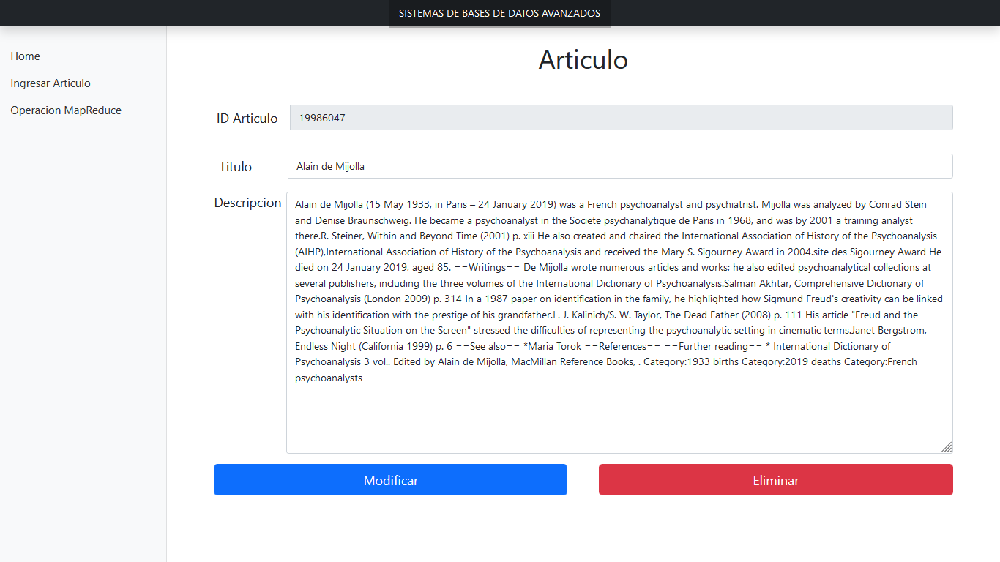
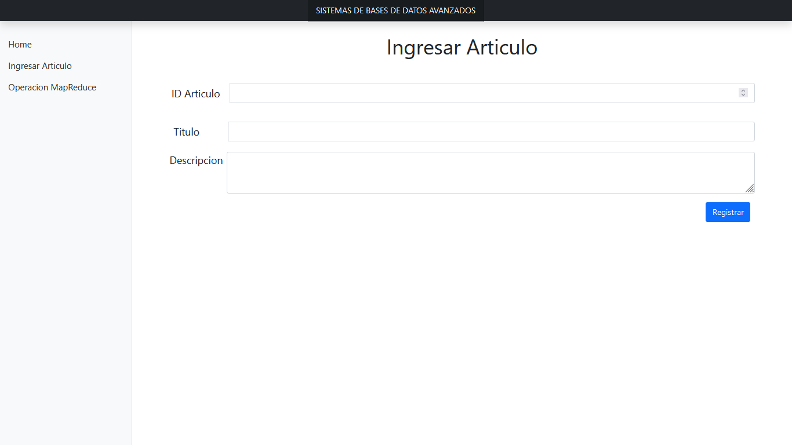
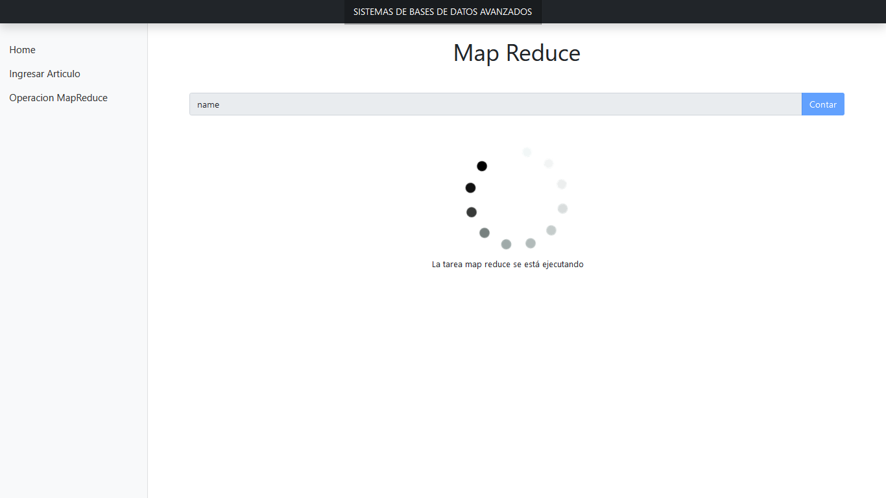
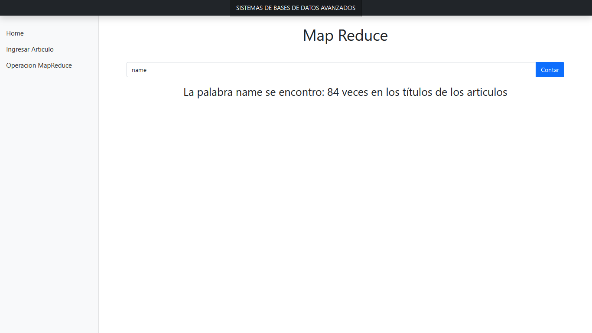
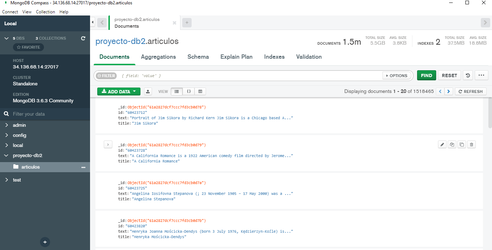

# Proyecto - Sistema de Datos Avanzados

### Instalar los paquetes de npm 📋
```
npm install
```

### Ejecutar el server 🛠️

```
npm start
```
## Capturas

### Home


### Detalle de un Articulo


### Agregar articulo


### Tarea MapReduce




### Servidor MongoDB


### Autores ✒️
* **Bryan Puchaicela** - *Trabajo* - [bryapuch](https://github.com/bryapuch)

* **Andrea Soriano** - *Trabajo* - [AndreaSoriano](https://github.com/AndreaSoriano)

* **Aron Caballero** - *Trabajo* - [Josue Caballero](https://github.com/Josue-Caballero)
